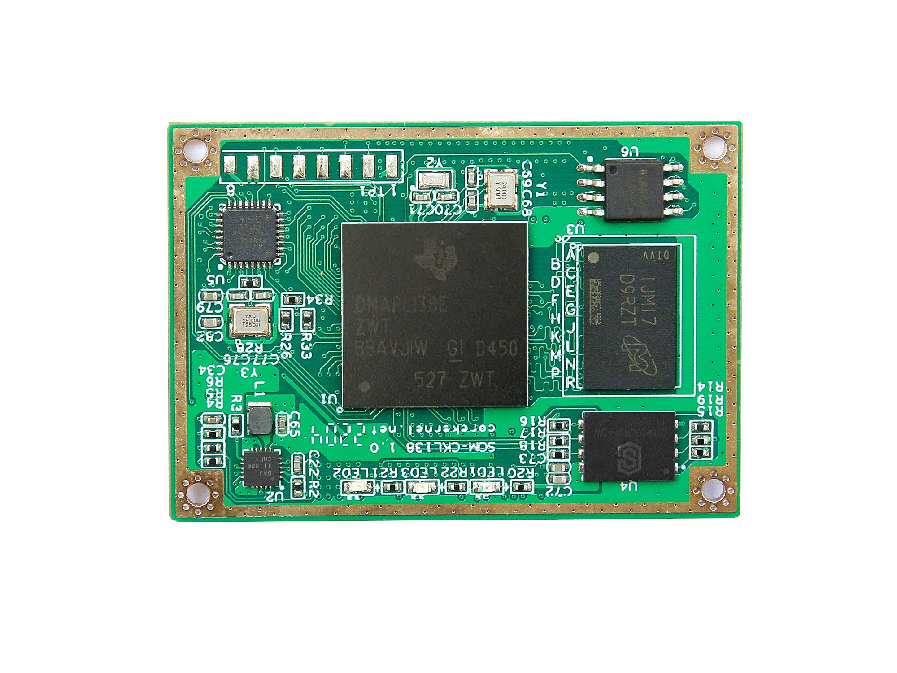
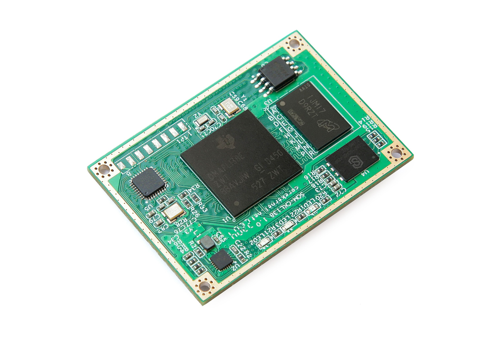
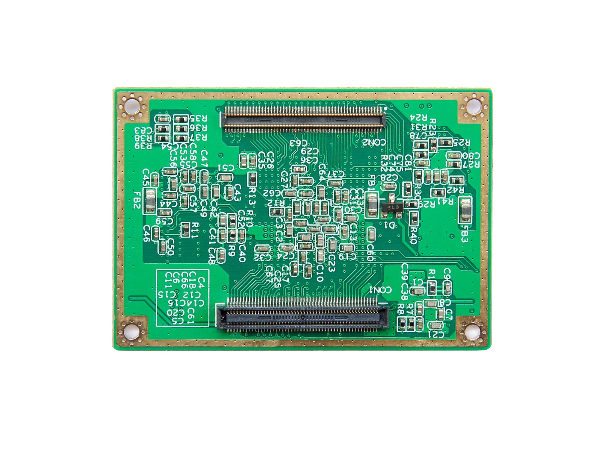

# SOM-CKL138 核心板

## 修订历史
| 版本 |      时间      |        作者        |    说明    |
| :--: | :------------: | :----------------: | :--------: |
| 1.00 | 2022年04月13日 | 希望缄默(bin wang) | 初始版本   |

## 概述
SOM-CKL138 核心板是基于 TI C6000 系列 DSP + ARM 异构多核架构定点/浮点数字信号处理器设计的核心板。  

## 参数
### 硬件参数
<table align="center">
    <tr>
        <th rowspan = "6">CPU 核心</th>
    </tr>
	<tr>
        <td>OMAP-L138</td>
    </tr>
	<tr>
        <td>软件/硬件兼容 OMAP-L132</td>
    </tr>
    <tr>
        <td>单核 DSP C674x 定点/浮点核心   主频 200/375/456MHz</td>
    </tr>
	<tr>
        <td>单核 ARM926EJ-S 核心   主频 200/375/456MHz</td>
    </tr>
    <tr>
        <td>双核 PRU(32位 RISC MCU)   主频为 DSP/ARM 核心频率的 $\frac{1}{2}$ 最高 228MHz</td>
    </tr>
	<tr>
        <th rowspan = "3">内存 RAM</td>
    </tr>
	<tr>
		<td>DDR2 128/256MBytes</td>
    </tr>
	<tr>
		<td>额外支持 SDRAM 128MBytes(需要在底板扩展)  
		    在实际应用中 ARM 核心使用 SDRAM DSP 核心使用 DDR2  
			可以减少内存访问竞争 提高系统性能
		</td>
    </tr>
	<tr>
        <th rowspan = "4">闪存 FLASH</td>
    </tr>
	<tr>
		<td>SPI NOR Flash 8MBytes 启动(U-BOOT/内核)</td>
    </tr>
	<tr>
		<td>SD NAND 128/512MBytes 启动(文件系统)和用户数据</td>
    </tr>
	<tr>
		<td>最大支持 4GBytes</td>
    </tr>
	<tr>
        <th rowspan = "3">LED</td>
    </tr>
	<tr>
		<td>3.3V 橙色电源 LED</td>
    </tr>
	<tr>
		<td>两个用户可编程绿色 LED</td>
    </tr>
	<tr>
        <th rowspan = "4">时钟</td>
    </tr>
	<tr>
		<td>24MHz CPU 主时钟</td>
    </tr>
	<tr>
		<td>32.768KHz RTC 时钟</td>
    </tr>
	<tr>
		<td>25MHz 网络 PHY 时钟</td>
    </tr>
	<tr>
		<th rowspan = "2">PHY</td>
    </tr>
	<tr>
		<td>LAN8710(MII 接口)  
		    10/100Mbps 网络收发器</td>
    </tr>
	<tr>
		<th rowspan = "4">连接器</td>
    </tr>
	<tr>
		<td>工业级精密高速连接器</td>
    </tr>
	<tr>
		<td>100Pin 母座</td>
    </tr>
	<tr>
		<td>100Pin 公座</td>
    </tr>
	<tr>
		<th rowspan = "2">工作电压</td>
    </tr>
	<tr>
		<td>5V 直流</td>
    </tr>
	<tr>
		<th rowspan = "2">环境温度</td>
    </tr>
	<tr>
		<td>工业级 -40°C - 85°C</td>
    </tr>
</table>

处理器详细外设参数请参阅  
[「OMAP-L138/C6748/AM1808 系列参数对比」](zh-cn/DSP/OMAP-L138_系列参数对比)

### 尺寸
<table align="center">
	<tr>
		<th rowspan = "3">PCB 尺寸</td>
    </tr>
	<tr>
		<td>50mm x 35mm</td>
    </tr>
	<tr>
		<td>提供核心板连接器与固定孔的组合封装库</td>
    </tr>
	<tr>
		<th rowspan = "2">PCB 层数</td>
    </tr>
	<tr>
		<td>8层 沉金工艺</td>
    </tr>
	<tr>
		<th rowspan = "2">PCB 厚度</td>
    </tr>
	<tr>
		<td>1.6mm</td>
    </tr>
	<tr>
		<th rowspan = "2">固定孔</td>
    </tr>
	<tr>
		<td>4 个 M2 规格螺丝孔位</td>
    </tr>
</table>

### 软件参数
<table align="center">
    <tr>
        <th rowspan = "13">DSP/PRU 核心</th>
    </tr>
    <tr>
        <th rowspan = "5">集成开发环境</th>
    </tr>
	<tr>
        <td>CCSv11</td>
    </tr>
    <tr>
        <td>DSP 裸机(NonOS)程序不依赖 CCS 版本 工程文件基于 CCSv11</td>
    </tr>
    <tr>
        <td>SYS/BIOS 实时操作系统例程需要 CCSv5 5.5 以上版本</td>
    </tr>
	<tr>
        <td>PRU 需要 CCSv6 以上版本支持 C/C++ 编译器   低于此版本不支持创建 PRU CCS 工程且需要使用汇编语言开发</td>
    </tr>
	<tr>
        <th rowspan = "7">例程</td>
    </tr>
	<tr>
		<td>StarterWare 驱动库裸机(NonOS)外设例程</td>
    </tr>
	<tr>
		<td>TI SYS/BIOS 实时操作系统例程</td>
    </tr>
	<tr>
		<td>NDK 网络协议栈例程</td>
    </tr>
	<tr>
		<td>mathlib/dsplib/imglib/vlib/volib 等算法库例程</td>
    </tr>
	<tr>
		<td>PRU 外设驱动例程以及 PRU 与 DSP 多核通信例程</td>
    </tr>
	<tr>
		<td>DSP 与 FPGA 多核通信例程</td>
    </tr>
	<tr>
        <th rowspan = "10">ARM 核心</th>
    </tr>
    <tr>
        <th rowspan = "9">Linux</th>
    </tr>
	<tr>
        <td>U-BOOT 2019.01</td>
    </tr>
    <tr>
        <td>Linux 内核 4.19.94(2019 LTS)</td>
    </tr>
    <tr>
        <td>Yocto Project 2.6(thud)</td>
    </tr>
	<tr>
        <td>Qt 5.11.3</td>
    </tr>
	<tr>
        <td>OpenCL 1.1.19</td>
    </tr>
	<tr>
        <td>OpenCV 3.1</td>
    </tr>
	<tr>
        <td>Wayland 1.16</td>
    </tr>
	<tr>
        <td>GStreamer 1.14.4</td>
    </tr>
	<tr>
        <th rowspan = "3">DSP/ARM 双核通信</th>
    </tr>
	<tr>
        <td>IPCLite</td>
		<td>使用中断和共享内存简单双核通信   支持裸机(NonOS)和操作系统</td>
    </tr>
    <tr>
        <td>IPC</td>
		<td>使用 IPC 实时软件组件双核通信   ARM 需要运行 Linux 系统   DSP 需要运行 SYS/BIOS 实时操作系统</td>
    </tr>
    <tr>
        <th rowspan = "3">软件开发套件</td>
    </tr>
	<tr>
        <th colspan = "2">PROCESSOR SDK LINUX 06.03.00.106</td>
    </tr>
	<tr>
        <th colspan = "2">PROCESSOR SDK RTOS 06.03.00.106</td>
    </tr>
</table>

## 订购信息
|     型号    |  DSP + ARM  |   主频   |    DDR2   |  SD NAND  | 温度级别 | 安全启动 |   其它   |
| :---------: | :---------: | :------: | :-------: | :-------: | :------: | :------: | :------: |
| SOM-CKL138A |  OMAP-L138  |  456MHz  | 128MBytes | 128MBytes |  工业级  |  不支持  |          |
| SOM-CKL138B |  OMAP-L138  |  456MHz  | 256MBytes |  4GBytes  |  工业级  |  不支持  |          |
| SOM-CKL138C |  OMAP-L138  |  456MHz  | 256MBytes |  4GBytes  |  工业级  | DSP 支持 | 程序加密 |
| SOM-CKL132A |  OMAP-L132  |  200MHz  | 128MBytes | 128MBytes |  工业级  |  不支持  | 超低功耗 |
| SOM-CKL132B |  OMAP-L132  |  200MHz  | 128MBytes | 128MBytes |  商业级  |  不支持  | 超低功耗 |
|     定制    |             |          |           |           |          |          |          |

## 客户服务
**QQ 群**  
**DSP**  
OMAP-L138/C6748 群: 597894186  
C6657/C6678 群: 191333809  

**FPGA**  
FPGA 群: 215724712  
ZYNQ/MPSoC 群: 724234610  

**微信群** 

**微信公众号**  

**官网**  
[*corekernel.net*](http://corekernel.net)  
[*corekernel.org*](http://corekernel.org)  
[*corekernel.cn*](http://corekernel.cn)  

**社区**  
[*fpga.net.cn*](http://fpga.net.cn)