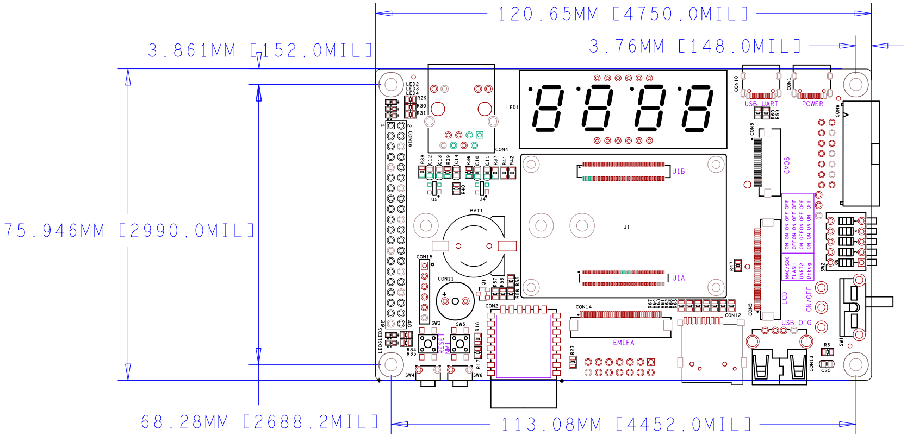
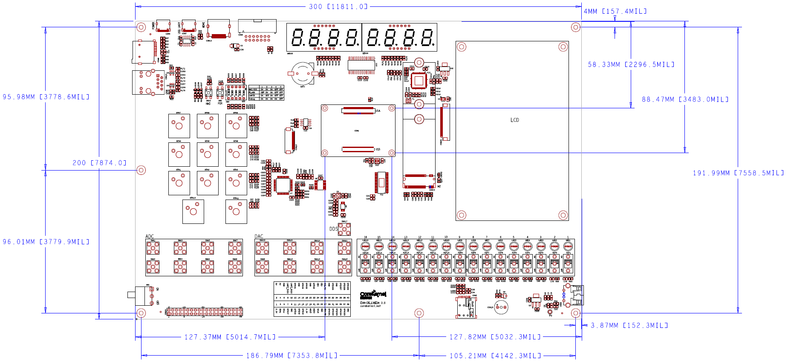

# SOM-CKL138 核心板

## 修订历史
| 版本 |      时间      |        作者        |    说明    |
| :--: | :------------: | :----------------: | :--------: |
| 1.00 | 2022年04月13日 | 希望缄默(bin wang) | 初始版本   |

## 概述
SOM-CKL138 核心板是基于 TI C6000 系列 DSP + ARM 异构多核架构定点/浮点数字信号处理器设计的核心板。  

## 参数
### 硬件参数
<table align="center">
    <tr>
        <th rowspan = "6">CPU 核心</th>
    </tr>
	<tr>
        <td>OMAP-L138</td>
    </tr>
	<tr>
        <td>软件/硬件兼容 OMAP-L132</td>
    </tr>
    <tr>
        <td>单核 DSP C674x 定点/浮点核心   主频 200/375/456MHz</td>
    </tr>
	<tr>
        <td>单核 ARM926EJ-S 核心   主频 200/375/456MHz</td>
    </tr>
    <tr>
        <td>双核 PRU(32位 RISC MCU)   主频为 DSP/ARM 核心频率的 $\frac{1}{2}$ 最高 228MHz</td>
    </tr>
	<tr>
        <th rowspan = "3">内存 RAM</td>
    </tr>
	<tr>
		<td>DDR2 128/256MBytes</td>
    </tr>
	<tr>
		<td>额外支持 SDRAM 128MBytes(需要在底板扩展)  
		    在实际应用中 ARM 核心使用 SDRAM DSP 核心使用 DDR2  
			可以减少内存访问竞争 提高系统性能
		</td>
    </tr>
	<tr>
        <th rowspan = "4">闪存 FLASH</td>
    </tr>
	<tr>
		<td>SPI NOR Flash 8MBytes 启动(U-BOOT/内核)</td>
    </tr>
	<tr>
		<td>SD NAND 128/512MBytes 启动(文件系统)和用户数据</td>
    </tr>
	<tr>
		<td>最大支持 4GBytes</td>
    </tr>
	<tr>
        <th rowspan = "3">LED</td>
    </tr>
	<tr>
		<td>3.3V 橙色电源 LED</td>
    </tr>
	<tr>
		<td>两个用户可编程绿色 LED</td>
    </tr>
	<tr>
        <th rowspan = "4">时钟</td>
    </tr>
	<tr>
		<td>24MHz CPU 主时钟</td>
    </tr>
	<tr>
		<td>32.768KHz RTC 时钟</td>
    </tr>
	<tr>
		<td>25MHz 网络 PHY 时钟</td>
    </tr>
	<tr>
		<th rowspan = "2">PHY</td>
    </tr>
	<tr>
		<td>LAN8710(MII 接口)  
		    10/100Mbps 网络收发器</td>
    </tr>
	<tr>
		<th rowspan = "4">连接器</td>
    </tr>
	<tr>
		<td>工业级精密高速连接器</td>
    </tr>
	<tr>
		<td>100Pin 母座</td>
    </tr>
	<tr>
		<td>100Pin 公座</td>
    </tr>
	<tr>
		<th rowspan = "2">工作电压</td>
    </tr>
	<tr>
		<td>5V 直流</td>
    </tr>
	<tr>
		<th rowspan = "2">环境温度</td>
    </tr>
	<tr>
		<td>工业级 -40°C - 85°C</td>
    </tr>
</table>

处理器详细外设参数请参阅  
[「OMAP-L138/C6748/AM1808 系列参数对比」](zh-cn/DSP/OMAP-L138_系列参数对比)

### 尺寸
<table align="center">
	<tr>
		<th rowspan = "3">PCB 尺寸</td>
    </tr>
	<tr>
		<td>50mm x 35mm</td>
    </tr>
	<tr>
		<td>提供核心板连接器与固定孔的组合封装库</td>
    </tr>
	<tr>
		<th rowspan = "2">PCB 层数</td>
    </tr>
	<tr>
		<td>8层 沉金工艺</td>
    </tr>
	<tr>
		<th rowspan = "2">PCB 厚度</td>
    </tr>
	<tr>
		<td>1.6mm</td>
    </tr>
	<tr>
		<th rowspan = "2">固定孔</td>
    </tr>
	<tr>
		<td>4 个 M2 规格螺丝孔位</td>
    </tr>
</table>

### 软件参数
<table align="center">
    <tr>
        <th rowspan = "13">DSP/PRU 核心</th>
    </tr>
    <tr>
        <th rowspan = "5">集成开发环境</th>
    </tr>
	<tr>
        <td>CCSv11</td>
    </tr>
    <tr>
        <td>DSP 裸机(NonOS)程序不依赖 CCS 版本 工程文件基于 CCSv11</td>
    </tr>
    <tr>
        <td>SYS/BIOS 实时操作系统例程需要 CCSv5 5.5 以上版本</td>
    </tr>
	<tr>
        <td>PRU 需要 CCSv6 以上版本支持 C/C++ 编译器   低于此版本不支持创建 PRU CCS 工程且需要使用汇编语言开发</td>
    </tr>
	<tr>
        <th rowspan = "7">例程</td>
    </tr>
	<tr>
		<td>StarterWare 驱动库裸机(NonOS)外设例程</td>
    </tr>
	<tr>
		<td>TI SYS/BIOS 实时操作系统例程</td>
    </tr>
	<tr>
		<td>NDK 网络协议栈例程</td>
    </tr>
	<tr>
		<td>mathlib/dsplib/imglib/vlib/volib 等算法库例程</td>
    </tr>
	<tr>
		<td>PRU 外设驱动例程以及 PRU 与 DSP 多核通信例程</td>
    </tr>
	<tr>
		<td>DSP 与 FPGA 多核通信例程</td>
    </tr>
	<tr>
        <th rowspan = "10">ARM 核心</th>
    </tr>
    <tr>
        <th rowspan = "9">Linux</th>
    </tr>
	<tr>
        <td>U-BOOT 2019.01</td>
    </tr>
    <tr>
        <td>Linux 内核 4.19.94(2019 LTS)</td>
    </tr>
    <tr>
        <td>Yocto Project 2.6(thud)</td>
    </tr>
	<tr>
        <td>Qt 5.11.3</td>
    </tr>
	<tr>
        <td>OpenCL 1.1.19</td>
    </tr>
	<tr>
        <td>OpenCV 3.1</td>
    </tr>
	<tr>
        <td>Wayland 1.16</td>
    </tr>
	<tr>
        <td>GStreamer 1.14.4</td>
    </tr>
	<tr>
        <th rowspan = "3">DSP/ARM 双核通信</th>
    </tr>
	<tr>
        <td>IPCLite</td>
		<td>使用中断和共享内存简单双核通信   支持裸机(NonOS)和操作系统</td>
    </tr>
    <tr>
        <td>IPC</td>
		<td>使用 IPC 实时软件组件双核通信   ARM 需要运行 Linux 系统   DSP 需要运行 SYS/BIOS 实时操作系统</td>
    </tr>
    <tr>
        <th rowspan = "3">软件开发套件</td>
    </tr>
	<tr>
        <th colspan = "2">PROCESSOR SDK LINUX 06.03.00.106</td>
    </tr>
	<tr>
        <th colspan = "2">PROCESSOR SDK RTOS 06.03.00.106</td>
    </tr>
</table>

## 订购信息
|     型号    |  DSP + ARM  |   主频   |    DDR2   |  SD NAND  | 温度级别 | 安全启动 |   其它   |
| :---------: | :---------: | :------: | :-------: | :-------: | :------: | :------: | :------: |
| SOM-CKL138A |  OMAP-L138  |  456MHz  | 128MBytes | 128MBytes |  工业级  |  不支持  |          |
| SOM-CKL138B |  OMAP-L138  |  456MHz  | 256MBytes |  4GBytes  |  工业级  |  不支持  |          |
| SOM-CKL138C |  OMAP-L138  |  456MHz  | 256MBytes |  4GBytes  |  工业级  | DSP 支持 | 程序加密 |
| SOM-CKL132A |  OMAP-L132  |  200MHz  | 128MBytes | 128MBytes |  工业级  |  不支持  | 超低功耗 |
| SOM-CKL132B |  OMAP-L132  |  200MHz  | 128MBytes | 128MBytes |  商业级  |  不支持  | 超低功耗 |
|     定制    |             |          |           |           |          |          |          |

# EVM-CKL138PKT/EVM-CK6748PKT 口袋板

## 修订历史
| 版本 |      时间      |        作者        |    说明    |
| :--: | :------------: | :----------------: | :--------: |
| 1.00 | 2022年04月14日 | 希望缄默(bin wang) | 初始版本   |

## 概述
EVM-CKL138PKT/EVM-CK6748PKT 口袋板是基于 SOM-CKL138/SOM-CK6748 核心板设计的便携式开发板。  

## 参数
### 硬件参数
<table align="center">
    <tr>
        <th rowspan = "4">核心板</th>
    </tr>
	<tr>
        <td>DSP + ARM 核心板   SOM-CKL138/SOM-CKL132</td>
    </tr>
	<tr>
        <td>DSP 核心板   SOM-CK6748/SOM-CK6746/SOM-CK6742</td>
    </tr>
    <tr>
        <td>ARM 核心板   SOM-CK1810/SOM-CK1808</td>
    </tr>
	<tr>
        <th rowspan = "4">LED</td>
    </tr>
	<tr>
		<td>3.3V 橙色电源 LED</td>
    </tr>
	<tr>
		<td>两个用户可编程绿色 LED</td>
    </tr>
	<tr>
		<td>两个 WIFI 模块可编程绿色 LED(仅限硬件版本 1.0)</td>
    </tr>
	<tr>
        <th rowspan = "1">WIFI/BT 模块</td>
		<td>2.4GHz WIFI 及蓝牙模块(仅限硬件版本 1.0)</td>
    </tr>
	<tr>
        <th rowspan = "1">数码管</td>
		<td>4 位 GPIO 直接驱动数码管</td>
    </tr>
	<tr>
        <th rowspan = "4">按键</td>
    </tr>
	<tr>
		<td>红色 POR 复位按键</td>
    </tr>
	<tr>
		<td>红色 NMI 不可屏蔽中断按键</td>
    </tr>
	<tr>
		<td>两个用户可编程按键(位于侧面)</td>
    </tr>
	<tr>
        <th rowspan = "1">蜂鸣器</td>
		<td>可通过 GPIO 或者 ECAP 辅助 PWM 控制</td>
    </tr>
	<tr>
        <th rowspan = "2">RTC</td>
    </tr>
	<tr>
		<td>不可充电 RTC 电池座  
		    支持 CR1220 3V 电池 用于板卡断电后保存时间</td>
    </tr>
	<tr>
        <th rowspan = "2">SD 卡</td>
    </tr>
	<tr>
		<td>支持 Micro SD 卡(或称为 TF 卡)</td>
    </tr>
	<tr>
        <th rowspan = "1">温湿度传感器</td>
		<td>SHT30 高精度数字温湿度传感器</td>
    </tr>
	<tr>
		<th rowspan = "2">RJ45</td>
    </tr>
	<tr>
		<td>10/100Mbps 自适应网络</td>
    </tr>
	<tr>
		<th rowspan = "4">USB</td>
    </tr>
	<tr>
		<td>USB Type-C 电源接口</td>
    </tr>
	<tr>
		<td>USB Type-C 转调试串口</td>
    </tr>
	<tr>
		<td>USB 2.0 OTG Type-A 接口(硬件版本 1.0 仅支持 Host 模式)</td>
    </tr>
	<tr>
        <th rowspan = "2">JTAG</td>
    </tr>
	<tr>
		<td>TI 14Pin 标准 JTAG 接口</td>
    </tr>
	<tr>
        <th rowspan = "4">M.2 Socket2   仅 ARM Linux 系统支持</td>
    </tr>
	<tr>
		<td>支持连接 M.2(NGFF) 2242/2280 SATA 硬盘   兼容 SATA I 1.5Gbps 和 SATA II 3Gbps 硬盘</td>
    </tr>
	<tr>
		<td>支持连接 M.2(NGFF) 2242/3052 4G 模块(USB 总线)</td>
    </tr>
	<tr>
		<td>支持 NANO SIM 卡</td>
    </tr>
	<tr>
        <th rowspan = "5">音频</td>
    </tr>
	<tr>
		<td>外接音频模块(仅限硬件版本 1.0)</td>
    </tr>
	<tr>
		<td>板载高精度数字麦克风(仅限硬件版本 2.0)</td>
    </tr>
	<tr>
		<td>立体声扬声器接口(仅限硬件版本 2.0)</td>
    </tr>
	<tr>
		<td>3.5mm 4 段式耳机接口支持麦克风和扬声器(仅限硬件版本 2.0)</td>
    </tr>
	<tr>
        <th rowspan = "2">视频输入</td>
    </tr>
	<tr>
		<td>直接连接数字摄像头(例如 OV2640)  
		    或通过视频编码模块输入模拟信号  
			24Pin 0.5mm FFC</td>
    </tr>
	<tr>
        <th rowspan = "2">视频输出</td>
    </tr>
	<tr>
		<td>5 英寸电容触摸液晶屏   40Pin 0.5mm 间距 FFC 连接器</td>
    </tr>
	<tr>
        <th rowspan = "4">扩展接口</td>
    </tr>
	<tr>
		<td>6Pin 2.54 排母 连接 PS2 手柄无线接收器或其它 SPI 总线模块</td>
    </tr>
	<tr>
		<td>40Pin 0.5mm 间距 FFC EMIFA 内存接口 连接 Intel 8080 接口 LCD/FPGA 模块等</td>
    </tr>
	<tr>
		<td> <b>40Pin 2.54mm 间距树莓派兼容排针</b>  
		     连接树莓派扩展模块 RGB 点阵/AD/DA/NFC/LORA/LCD/传感器/RS232/RS485/CAN/电机/继电器/音频等模块</td>
    </tr>
	<tr>
		<th rowspan = "3">开关</td>
    </tr>
	<tr>
		<td>侧面拨动电源开关</td>
    </tr>
	<tr>
		<td>侧面拨动启动模式选择拨码开关</td>
    </tr>
	<tr>
		<th rowspan = "1">工作电压</td>
		<td>5V 2A 直流</td>
    </tr>
	<tr>
		<th rowspan = "1">环境温度</td>
		<td>商业级 0°C - 85°C</td>
    </tr>
</table>

核心板详细参数请参阅  
[「SOM-CKL138 系列核心板参数」](zh-cn/Product/SOM/SOM-CKL138)  
[「SOM-CK6748 系列核心板参数」](zh-cn/Product/SOM/SOM-CK6748)  

树莓派扩展引脚
<table align="center">
    <tr>
		<td>芯片引脚</td>
		<td>功能</td>
		<td>引脚</td>
		<td>引脚</td>
		<td>功能</td>
		<td>芯片引脚</td>
    </tr>
	<tr>
		<td> </td>
		<td bgcolor="yellow">3.3V 电源</td>
		<td style="text-align: center;">1</td>
		<td style="text-align: center;">2</td>
		<td bgcolor="orange">5V 电源</td>
		<td> </td>
    </tr>
	<tr>
		<td>GPIO0[02]/McASP_AXR10/McBSP1_DR1</td>
		<td bgcolor="green">SDA1</td>
		<td style="text-align: center;">3</td>
		<td style="text-align: center;">4</td>
		<td bgcolor="orange">5V 电源</td>
		<td> </td>
    </tr>
	<tr>
		<td>GPIO0[01]/McASP_AXR09/McBSP1_DX1</td>
		<td bgcolor="green">SCL1</td>
		<td style="text-align: center;">5</td>
		<td style="text-align: center;">6</td>
		<td bgcolor="black">GND</td>
		<td> </td>
    </tr>
	<tr>
		<td>GPIO0[15]/McASP_ACLKR</td>
		<td bgcolor="green">GPIO7</td>
		<td style="text-align: center;">7</td>
		<td style="text-align: center;">8</td>
		<td bgcolor="green">TXD</td>
		<td>GPIO1[00]/SPI1_SCS2/UART1_TXD</td>
    </tr>
	<tr>
		<td> </td>
		<td bgcolor="black">GND</td>
		<td style="text-align: center;">9</td>
		<td style="text-align: center;">10</td>
		<td bgcolor="green">RXD</td>
		<td>GPIO1[01]/SPI1_SCS3/UART1_RXD</td>
    </tr>
	<tr>
		<td>GPIO0[10]/McASP_AHCLKX/UART1_CTS/USB_REFCLKIN</td>
		<td bgcolor="green">GPIO0</td>
		<td style="text-align: center;">11</td>
		<td style="text-align: center;">12</td>
		<td bgcolor="green">GPIO1</td>
		<td>GPIO0[05]/McASP_AXR13/McBSP1_CLKX1</td>
    </tr>
	<tr>
		<td>GPIO0[14]/McASP_ACLKX</td>
		<td bgcolor="green">GPIO2</td>
		<td style="text-align: center;">13</td>
		<td style="text-align: center;">14</td>
		<td bgcolor="black">GND</td>
		<td> </td>
    </tr>
	<tr>
		<td>GPIO0[12]/McASP_AFSX</td>
		<td bgcolor="green">GPIO3</td>
		<td style="text-align: center;">15</td>
		<td style="text-align: center;">16</td>
		<td bgcolor="green">GPIO4</td>
		<td>GPIO0[03]/McASP_AXR11/McBSP1_FSX1</td>
    </tr>
	<tr>
		<td> </td>
		<td bgcolor="yellow">3.3V 电源</td>
		<td style="text-align: center;">17</td>
		<td style="text-align: center;">18</td>
		<td bgcolor="green">GPIO5</td>
		<td>GPIO0[04]/McASP_AXR12/McBSP1_FSR1</td>
    </tr>
	<tr>
		<td>GPIO2[10]/SPI1_SIMO</td>
		<td bgcolor="green">MOSI</td>
		<td style="text-align: center;">19</td>
		<td style="text-align: center;">20</td>
		<td bgcolor="black">GND</td>
		<td> </td>
    </tr>
	<tr>
		<td>GPIO2[11]/SPI1_SOMI</td>
		<td bgcolor="green">MISO</td>
		<td style="text-align: center;">21</td>
		<td style="text-align: center;">22</td>
		<td bgcolor="green">GPIO6</td>
		<td>GPIO0[06]/McASP_AXR14/McBSP1_CLKR1</td>
    </tr>
	<tr>
		<td>GPIO2[13]/SPI1_CLK</td>
		<td bgcolor="green">SCLK</td>
		<td style="text-align: center;">23</td>
		<td style="text-align: center;">24</td>
		<td bgcolor="green">CE0</td>
		<td>GPIO2[14]/SPI1_SCS0/TIMER64P3_IN12/EPWM1_B</td>
    </tr>
	<tr>
		<td> </td>
		<td bgcolor="black">GND</td>
		<td style="text-align: center;">25</td>
		<td style="text-align: center;">26</td>
		<td bgcolor="green">CE1</td>
		<td>GPIO2[15]/SPI1_SCS1/TIMER64P2_IN12/EPWM1_A</td>
    </tr>
	<tr>
		<td>GPIO1[04]/SPI1_SCS6/TIMER64P3_OUT12/I2C0_SDA</td>
		<td bgcolor="blue">SDA0</td>
		<td style="text-align: center;">27</td>
		<td style="text-align: center;">28</td>
		<td bgcolor="blue">SCL0</td>
		<td>GPIO1[05]/SPI1_SCS7/TIMER64P2_OUT12/I2C0_SCL</td>
    </tr>
	<tr>
		<td>GPIO6[11]/UPP_CHA_CLK</td>
		<td bgcolor="green">GPIO21</td>
		<td style="text-align: center;">29</td>
		<td style="text-align: center;">30</td>
		<td bgcolor="black">GND</td>
		<td> </td>
    </tr>
	<tr>
		<td>GPIO6[09]/UPP_CHA_ENABLE</td>
		<td bgcolor="green">GPIO22</td>
		<td style="text-align: center;">31</td>
		<td style="text-align: center;">32</td>
		<td bgcolor="green">GPIO26</td>
		<td>GPIO0[11]/McASP_AHCLKR/UART1_RTS</td>
    </tr>
	<tr>
		<td>GPIO6[10]/UPP_CHA_START</td>
		<td bgcolor="green">GPIO23</td>
		<td style="text-align: center;">33</td>
		<td style="text-align: center;">34</td>
		<td bgcolor="black">GND</td>
		<td> </td>
    </tr>
	<tr>
		<td>GPIO6[08]/UPP_CHA_WAIT</td>
		<td bgcolor="green">GPIO24</td>
		<td style="text-align: center;">35</td>
		<td style="text-align: center;">36</td>
		<td bgcolor="green">GPIO27</td>
		<td>GPIO0[13]/McASP_AFSR</td>
    </tr>
	<tr>
		<td>GPIO6[14]/CLKOUT</td>
		<td bgcolor="green">GPIO25</td>
		<td style="text-align: center;">37</td>
		<td style="text-align: center;">38</td>
		<td bgcolor="green">GPIO28</td>
		<td>GPIO0[09]/McASP_AMUTE/UART2_RTS</td>
    </tr>
	<tr>
		<td> </td>
		<td bgcolor="black">GND</td>
		<td style="text-align: center;">39</td>
		<td style="text-align: center;">40</td>
		<td bgcolor="green">GPIO29</td>
		<td>GPIO1[15]/McASP_AXR07/EPWMN1_TZ[0]</td>
    </tr>
</table>

### 尺寸
<table align="center">
	<tr>
		<th rowspan = "1">PCB 尺寸</td>
		<td>120mm x 75mm</td>
    </tr>
	<tr>
		<th rowspan = "1">PCB 层数</td>
		<td>4层 沉金工艺</td>
    </tr>
	<tr>
		<th rowspan = "1">PCB 厚度</td>
		<td>1.6mm</td>
    </tr>
	<tr>
		<th rowspan = "4">固定孔</td>
    </tr>
	<tr>
		<td>4 个 M2 规格核心板固定螺丝孔位</td>
    </tr>
	<tr>
		<td>4 个 M3规格底板/液晶屏固定螺丝孔位</td>
    </tr>
	<tr>
		<td>3 个 M2.5 规格 M.2 Socket2 2242/3052/2280 固定螺丝孔位</td>
    </tr>
</table>

### 软件参数
<table align="center">
    <tr>
        <th rowspan = "13">DSP/PRU 核心</th>
    </tr>
    <tr>
        <th rowspan = "5">集成开发环境</th>
    </tr>
	<tr>
        <td>CCSv11</td>
    </tr>
    <tr>
        <td>DSP 裸机(NonOS)程序不依赖 CCS 版本 工程文件基于 CCSv11</td>
    </tr>
    <tr>
        <td>SYS/BIOS 实时操作系统例程需要 CCSv5 5.5 以上版本</td>
    </tr>
	<tr>
        <td>PRU 需要 CCSv6 以上版本支持 C/C++ 编译器   低于此版本不支持创建 PRU CCS 工程且需要使用汇编语言开发</td>
    </tr>
	<tr>
        <th rowspan = "7">例程</td>
    </tr>
	<tr>
		<td>StarterWare 驱动库裸机(NonOS)外设例程</td>
    </tr>
	<tr>
		<td>TI SYS/BIOS 实时操作系统例程</td>
    </tr>
	<tr>
		<td>NDK 网络协议栈例程</td>
    </tr>
	<tr>
		<td>mathlib/dsplib/imglib/vlib/volib 等算法库例程</td>
    </tr>
	<tr>
		<td>PRU 外设驱动例程以及 PRU 与 DSP 多核通信例程</td>
    </tr>
	<tr>
		<td>DSP 与 FPGA 多核通信例程</td>
    </tr>
	<tr>
        <th rowspan = "10">ARM 核心</th>
    </tr>
    <tr>
        <th rowspan = "9">Linux</th>
    </tr>
	<tr>
        <td>U-BOOT 2019.01</td>
    </tr>
    <tr>
        <td>Linux 内核 4.19.94(2019 LTS)</td>
    </tr>
    <tr>
        <td>Yocto Project 2.6(thud)</td>
    </tr>
	<tr>
        <td>Qt 5.11.3</td>
    </tr>
	<tr>
        <td>OpenCL 1.1.19</td>
    </tr>
	<tr>
        <td>OpenCV 3.1</td>
    </tr>
	<tr>
        <td>Wayland 1.16</td>
    </tr>
	<tr>
        <td>GStreamer 1.14.4</td>
    </tr>
	<tr>
        <th rowspan = "3">DSP/ARM 双核通信</th>
    </tr>
	<tr>
        <td>IPCLite</td>
		<td>使用中断和共享内存简单双核通信   支持裸机(NonOS)和操作系统</td>
    </tr>
    <tr>
        <td>IPC</td>
		<td>使用 IPC 实时软件组件双核通信   ARM 需要运行 Linux 系统   DSP 需要运行 SYS/BIOS 实时操作系统</td>
    </tr>
    <tr>
        <th rowspan = "3">软件开发套件</td>
    </tr>
	<tr>
        <th colspan = "2">PROCESSOR SDK LINUX 06.03.00.106</td>
    </tr>
	<tr>
        <th colspan = "2">PROCESSOR SDK RTOS 06.03.00.106</td>
    </tr>
</table>

### 功耗
|        板卡        | 测试条件                                       | 电压 | 电流 | 功耗 |
| :----------------- | :--------------------------------------------- | :--: | :--: | :--: |
| SOM-CKL138 核心板  | 室温 25°C 冷启动不执行任何程序                 | TBD  | TBD  | TBD  |
| SOM-CK6748 核心板  | 室温 25°C 冷启动不执行任何程序                 | TBD  | TBD  | TBD  |
| SOM-CK6748 核心板  | 室温 25°C LED 程序                             | TBD  | TBD  | TBD  |
| 口袋版底板         | 室温 25°C 冷启动不执行任何程序                 | TBD  | TBD  | TBD  |
| EVM-CKL138PKT 整版 | 室温 25°C ARM/DSP/PRU 运行板卡测试程序         | TBD  | TBD  | TBD  |
| EVM-CKL138PKT 整版 | 高低温实验箱 85°C ARM/DSP/PRU 运行板卡测试程序 | TBD  | TBD  | TBD  |

## 出货清单
<table align="center">
	<tr>
		<th rowspan = "1">核心板</td>
		<td>1 块</td>
		<td>出厂时已插入底板</td>
    </tr>
	<tr>
		<th rowspan = "1">口袋版底板</td>
		<td>1 块</td>
		<td> </td>
    </tr>
	<tr>
		<th rowspan = "3">文件</td>
    </tr>
	<tr>
		<td>若干</td>
		<td>快速开箱指南</td>
    </tr>
	<tr>
		<td>若干</td>
		<td>保修卡</td>
    </tr>
	<tr>
		<th rowspan = "1">包装</td>
		<td>1 套</td>
		<td> </td>
    </tr>
	<tr>
		<th rowspan = "1">电源适配器</td>
		<td>1 个</td>
		<td>5V 2A</td>
    </tr>
	<tr>
		<th rowspan = "2">数据线</td>
    </tr>
	<tr>
		<td> <b>赠品</b> 1 条</td>
		<td>USB Type-A 转 USB Type-C 数据线</td>
    </tr>
	<tr>
		<th rowspan = "1">网线</td>
		<td> <b>赠品</b> 1 条</td>
		<td>直通 5 类网线</td>
    </tr>
	<tr>
		<th rowspan = "3">SD 卡</td>
    </tr>
	<tr>
		<td> <b>赠品</b> 1 个</td>
		<td>4G Micro SD 卡(或称为 TF 卡)</td>
    </tr>
	<tr>
		<td> <b>赠品</b> 1 个</td>
		<td>读卡器</td>
    </tr>
	<tr>
		<th rowspan = "2">螺丝</td>
    </tr>
	<tr>
		<td> <b>赠品</b> 若干</td>
		<td>铜柱、塑料柱以及螺丝等</td>
    </tr>
	<tr>
		<th rowspan = "4">资料</td>
    </tr>
	<tr>
		<td> <b>可选</b> </td>
		<td>网络传输</td>
    </tr>
	<tr>
		<td> <b>可选</b> 1 个</td>
		<td>光盘</td>
    </tr>
	<tr>
		<td> <b>可选</b> 1 个</td>
		<td>U 盘</td>
    </tr>
	<tr>
		<th rowspan = "4">其它</td>
    </tr>
	<tr>
		<td> <b>赠品</b> 若干</td>
		<td>杜邦线</td>
    </tr>
	<tr>
		<td> <b>赠品</b> 1个</td>
		<td>核心板拆卸工具</td>
    </tr>
	<tr>
		<td> <b>赠品</b> 1个</td>
		<td>绝缘垫/防静电手环</td>
    </tr>
</table>

## 订购信息
|      型号     |    核心板    |   主频   |    DDR2   |  SD NAND  | 温度级别 | 安全启动 |   其它   |
| :-----------: | :----------: | :------: | :-------: | :-------: | :------: | :------: | :------: |
| EVM-CKL138PKT |  SOM-CKL138  |  456MHz  | 256MBytes |  4GBytes  |  工业级  |  不支持  |          |
| EVM-CK6748PKT |  SOM-CK6748  |  456MHz  | 128MBytes | 128MBytes |  工业级  |  不支持  |          |
|      定制     |              |          |           |           |          |          |          |

# EVM-CKL138EDA/EVM-CK6748EDA 实验箱

## 修订历史
| 版本 |      时间      |        作者        |    说明    |
| :--: | :------------: | :----------------: | :--------: |
| 1.00 | 2022年04月17日 | 希望缄默(bin wang) | 初始版本   |

## 概述
EVM-CK6748EDA/EVM-CKL138EDA 是面向高校嵌入式 DSP/DSP+ARM 异构多核教学设计的实验箱。  

## 参数
### 硬件参数
<table align="center">
    <tr>
        <th rowspan = "4">核心板</th>
    </tr>
	<tr>
        <td>DSP + ARM 核心板   SOM-CKL138/SOM-CKL132</td>
    </tr>
	<tr>
        <td>DSP 核心板   SOM-CK6748/SOM-CK6746/SOM-CK6742</td>
    </tr>
    <tr>
        <td>ARM 核心板   SOM-CK1810/SOM-CK1808</td>
    </tr>
	<tr>
        <th rowspan = "4">LED</td>
    </tr>
	<tr>
		<td>5V 橙色电源 LED</td>
    </tr>
	<tr>
		<td>两个用户可编程绿色 LED</td>
    </tr>
	<tr>
		<td>16 位 RGB 彩色 LED</td>
    </tr>
	<tr>
        <th rowspan = "1">数码管</td>
		<td>8 位数码管(CH452A 驱动)</td>
    </tr>
	<tr>
        <th rowspan = "3">按键</td>
    </tr>
	<tr>
		<td>红色 POR 复位按键</td>
    </tr>
	<tr>
		<td>红色 NMI 不可屏蔽中断按键</td>
    </tr>
	<tr>
        <th rowspan = "2">拨动开关</td>
    </tr>
	<tr>
		<td>16位拨动开关</td>
    </tr>
	<tr>
        <th rowspan = "2">键盘</td>
    </tr>
	<tr>
		<td>11键(0-9数字键和功能键)机械键盘 可选青轴红轴茶轴等轴体</td>
    </tr>
	<tr>
        <th rowspan = "1">蜂鸣器</td>
		<td>可通过 GPIO 或者 ECAP 辅助 PWM 控制</td>
    </tr>
	<tr>
        <th rowspan = "2">存储</td>
    </tr>
	<tr>
		<td>I2C EEPROM 256Bytes</td>
    </tr>
	<tr>
        <th rowspan = "2">RTC</td>
    </tr>
	<tr>
		<td>不可充电 RTC 电池座  
		    支持 CR1220 3V 电池 用于板卡断电后保存时间</td>
    </tr>
	<tr>
        <th rowspan = "2">SD 卡</td>
    </tr>
	<tr>
		<td>支持 Micro SD 卡(或称为 TF 卡)</td>
    </tr>
	<tr>
        <th rowspan = "1">温湿度传感器</td>
		<td>SHT30 高精度数字温湿度传感器</td>
    </tr>
	<tr>
		<th rowspan = "2">RJ45</td>
    </tr>
	<tr>
		<td>10/100Mbps 自适应网络</td>
    </tr>
	<tr>
		<th rowspan = "4">USB</td>
    </tr>
	<tr>
		<td>USB Type-C 电源接口</td>
    </tr>
	<tr>
		<td>USB Type-C 转调试串口</td>
    </tr>
	<tr>
		<td>USB 2.0 OTG Type-A 接口(硬件版本 3.0 仅支持 Host 模式)</td>
    </tr>
	<tr>
        <th rowspan = "2">JTAG</td>
    </tr>
	<tr>
		<td>TI 14Pin 标准 JTAG 接口</td>
    </tr>
	<tr>
        <th rowspan = "4">M.2 Socket2   仅 ARM Linux 系统支持</td>
    </tr>
	<tr>
		<td>支持连接 M.2(NGFF) 2242/2280 SATA 硬盘   兼容 SATA I 1.5Gbps 和 SATA II 3Gbps 硬盘</td>
    </tr>
	<tr>
		<td>支持连接 M.2(NGFF) 2242/3052 4G 模块(USB 总线)</td>
    </tr>
	<tr>
		<td>支持 NANO SIM 卡</td>
    </tr>
	<tr>
        <th rowspan = "5">音频</td>
    </tr>
	<tr>
		<td>外接音频模块(仅限硬件版本 3.0)</td>
    </tr>
	<tr>
		<td>板载高精度数字麦克风(仅限硬件版本 3.1)</td>
    </tr>
	<tr>
		<td>立体声扬声器接口(仅限硬件版本 3.1)</td>
    </tr>
	<tr>
		<td>3.5mm 4 段式耳机接口支持麦克风和扬声器(仅限硬件版本 3.1)</td>
    </tr>
	<tr>
        <th rowspan = "2">视频输入</td>
    </tr>
	<tr>
		<td>直接连接数字摄像头(例如 OV2640)  
		    或通过视频编码模块输入模拟信号  
			24Pin 0.5mm FFC</td>
    </tr>
	<tr>
        <th rowspan = "3">视频输出</td>
    </tr>
	<tr>
		<td>5 英寸电容触摸液晶屏   40Pin 0.5mm 间距 FFC 连接器</td>
    </tr>
	<tr>
		<td>HDMI 视频接口</td>
    </tr>
	<tr>
        <th rowspan = "2">模数转换 ADC</td>
    </tr>
	<tr>
		<td>AD7606/AD7606B 200KSPS 或 800KSPS 16 位 8 通道同步采样模数转换器</td>
    </tr>
	<tr>
        <th rowspan = "2">数模转换 DAC</td>
    </tr>
	<tr>
		<td>AD5676R 16 位 8 通道内置高精度基准源数模转换器</td>
    </tr>
	<tr>
        <th rowspan = "2">直接数字频率合成 DDS</td>
    </tr>
	<tr>
		<td>AD9833 频率相位可编程正弦波/三角波/方波数字波形输出</td>
    </tr>
	<tr>
        <th rowspan = "3">扩展接口</td>
    </tr>
	<tr>
		<td> <b>40Pin 2.54mm 间距树莓派兼容排针</b>  
		     连接树莓派扩展模块 RGB 点阵/AD/DA/NFC/LORA/LCD/传感器/RS232/RS485/CAN/电机/继电器/音频等模块</td>
    </tr>
	<tr>
		<td>连接实验箱扩展板(支持定制)</td>
    </tr>
	<tr>
		<th rowspan = "3">开关</td>
    </tr>
	<tr>
		<td>侧面拨动电源开关</td>
    </tr>
	<tr>
		<td>启动模式选择拨码开关</td>
    </tr>
	<tr>
		<th rowspan = "1">工作电压</td>
		<td>5V 2A 直流</td>
    </tr>
	<tr>
		<th rowspan = "1">环境温度</td>
		<td>商业级 0°C - 85°C</td>
    </tr>
</table>

核心板详细参数请参阅  
[「SOM-CKL138 系列核心板参数」](zh-cn/Product/SOM/SOM-CKL138)  
[「SOM-CK6748 系列核心板参数」](zh-cn/Product/SOM/SOM-CK6748)  

树莓派扩展引脚
<table align="center">
    <tr>
		<td>芯片引脚</td>
		<td>功能</td>
		<td>引脚</td>
		<td>引脚</td>
		<td>功能</td>
		<td>芯片引脚</td>
    </tr>
	<tr>
		<td> </td>
		<td bgcolor="yellow">3.3V 电源</td>
		<td style="text-align: center;">1</td>
		<td style="text-align: center;">2</td>
		<td bgcolor="orange">5V 电源</td>
		<td> </td>
    </tr>
	<tr>
		<td>GPIO0[02]/McASP_AXR10/McBSP1_DR1</td>
		<td bgcolor="green">SDA1</td>
		<td style="text-align: center;">3</td>
		<td style="text-align: center;">4</td>
		<td bgcolor="orange">5V 电源</td>
		<td> </td>
    </tr>
	<tr>
		<td>GPIO0[01]/McASP_AXR09/McBSP1_DX1</td>
		<td bgcolor="green">SCL1</td>
		<td style="text-align: center;">5</td>
		<td style="text-align: center;">6</td>
		<td bgcolor="black">GND</td>
		<td> </td>
    </tr>
	<tr>
		<td>GPIO0[15]/McASP_ACLKR</td>
		<td bgcolor="green">GPIO7</td>
		<td style="text-align: center;">7</td>
		<td style="text-align: center;">8</td>
		<td bgcolor="green">TXD</td>
		<td>GPIO1[00]/SPI1_SCS2/UART1_TXD</td>
    </tr>
	<tr>
		<td> </td>
		<td bgcolor="black">GND</td>
		<td style="text-align: center;">9</td>
		<td style="text-align: center;">10</td>
		<td bgcolor="green">RXD</td>
		<td>GPIO1[01]/SPI1_SCS3/UART1_RXD</td>
    </tr>
	<tr>
		<td>GPIO0[10]/McASP_AHCLKX/UART1_CTS/USB_REFCLKIN</td>
		<td bgcolor="green">GPIO0</td>
		<td style="text-align: center;">11</td>
		<td style="text-align: center;">12</td>
		<td bgcolor="green">GPIO1</td>
		<td>GPIO0[05]/McASP_AXR13/McBSP1_CLKX1</td>
    </tr>
	<tr>
		<td>GPIO0[14]/McASP_ACLKX</td>
		<td bgcolor="green">GPIO2</td>
		<td style="text-align: center;">13</td>
		<td style="text-align: center;">14</td>
		<td bgcolor="black">GND</td>
		<td> </td>
    </tr>
	<tr>
		<td>GPIO0[12]/McASP_AFSX</td>
		<td bgcolor="green">GPIO3</td>
		<td style="text-align: center;">15</td>
		<td style="text-align: center;">16</td>
		<td bgcolor="green">GPIO4</td>
		<td>GPIO0[03]/McASP_AXR11/McBSP1_FSX1</td>
    </tr>
	<tr>
		<td> </td>
		<td bgcolor="yellow">3.3V 电源</td>
		<td style="text-align: center;">17</td>
		<td style="text-align: center;">18</td>
		<td bgcolor="green">GPIO5</td>
		<td>GPIO0[04]/McASP_AXR12/McBSP1_FSR1</td>
    </tr>
	<tr>
		<td>GPIO2[10]/SPI1_SIMO</td>
		<td bgcolor="green">MOSI</td>
		<td style="text-align: center;">19</td>
		<td style="text-align: center;">20</td>
		<td bgcolor="black">GND</td>
		<td> </td>
    </tr>
	<tr>
		<td>GPIO2[11]/SPI1_SOMI</td>
		<td bgcolor="green">MISO</td>
		<td style="text-align: center;">21</td>
		<td style="text-align: center;">22</td>
		<td bgcolor="green">GPIO6</td>
		<td>GPIO0[06]/McASP_AXR14/McBSP1_CLKR1</td>
    </tr>
	<tr>
		<td>GPIO2[13]/SPI1_CLK</td>
		<td bgcolor="green">SCLK</td>
		<td style="text-align: center;">23</td>
		<td style="text-align: center;">24</td>
		<td bgcolor="green">CE0</td>
		<td>GPIO2[14]/SPI1_SCS0/TIMER64P3_IN12/EPWM1_B</td>
    </tr>
	<tr>
		<td> </td>
		<td bgcolor="black">GND</td>
		<td style="text-align: center;">25</td>
		<td style="text-align: center;">26</td>
		<td bgcolor="green">CE1</td>
		<td>GPIO2[15]/SPI1_SCS1/TIMER64P2_IN12/EPWM1_A</td>
    </tr>
	<tr>
		<td>GPIO1[04]/SPI1_SCS6/TIMER64P3_OUT12/I2C0_SDA</td>
		<td bgcolor="blue">SDA0</td>
		<td style="text-align: center;">27</td>
		<td style="text-align: center;">28</td>
		<td bgcolor="blue">SCL0</td>
		<td>GPIO1[05]/SPI1_SCS7/TIMER64P2_OUT12/I2C0_SCL</td>
    </tr>
	<tr>
		<td>GPIO6[11]/UPP_CHA_CLK</td>
		<td bgcolor="green">GPIO21</td>
		<td style="text-align: center;">29</td>
		<td style="text-align: center;">30</td>
		<td bgcolor="black">GND</td>
		<td> </td>
    </tr>
	<tr>
		<td>GPIO6[09]/UPP_CHA_ENABLE</td>
		<td bgcolor="green">GPIO22</td>
		<td style="text-align: center;">31</td>
		<td style="text-align: center;">32</td>
		<td bgcolor="green">GPIO26</td>
		<td>GPIO0[11]/McASP_AHCLKR/UART1_RTS</td>
    </tr>
	<tr>
		<td>GPIO6[10]/UPP_CHA_START</td>
		<td bgcolor="green">GPIO23</td>
		<td style="text-align: center;">33</td>
		<td style="text-align: center;">34</td>
		<td bgcolor="black">GND</td>
		<td> </td>
    </tr>
	<tr>
		<td>GPIO6[08]/UPP_CHA_WAIT</td>
		<td bgcolor="green">GPIO24</td>
		<td style="text-align: center;">35</td>
		<td style="text-align: center;">36</td>
		<td bgcolor="green">GPIO27</td>
		<td>GPIO0[13]/McASP_AFSR</td>
    </tr>
	<tr>
		<td>GPIO6[14]/CLKOUT</td>
		<td bgcolor="green">GPIO25</td>
		<td style="text-align: center;">37</td>
		<td style="text-align: center;">38</td>
		<td bgcolor="green">GPIO28</td>
		<td>GPIO0[09]/McASP_AMUTE/UART2_RTS</td>
    </tr>
	<tr>
		<td> </td>
		<td bgcolor="black">GND</td>
		<td style="text-align: center;">39</td>
		<td style="text-align: center;">40</td>
		<td bgcolor="green">GPIO29</td>
		<td>GPIO1[15]/McASP_AXR07/EPWMN1_TZ[0]</td>
    </tr>
</table>

### 尺寸
<table align="center">
	<tr>
		<th rowspan = "1">PCB 尺寸</td>
		<td>300mm x 200mm</td>
    </tr>
	<tr>
		<th rowspan = "1">PCB 层数</td>
		<td>4层 沉金工艺</td>
    </tr>
	<tr>
		<th rowspan = "1">PCB 厚度</td>
		<td>1.6mm</td>
    </tr>
	<tr>
		<th rowspan = "5">固定孔</td>
    </tr>
	<tr>
		<td>4 个 M2 规格核心板固定螺丝孔位</td>
    </tr>
	<tr>
		<td>6 个 M2.5 规格底板固定螺丝孔位</td>
    </tr>
	<tr>
		<td>3 个 M2.5 规格 M.2 Socket2 2242/3052/2280 固定螺丝孔位</td>
    </tr>
	<tr>
		<td>4 个 M3 规格液晶屏固定螺丝孔位</td>
    </tr>
</table>

### 软件参数
<table align="center">
    <tr>
        <th rowspan = "13">DSP/PRU 核心</th>
    </tr>
    <tr>
        <th rowspan = "5">集成开发环境</th>
    </tr>
	<tr>
        <td>CCSv11</td>
    </tr>
    <tr>
        <td>DSP 裸机(NonOS)程序不依赖 CCS 版本 工程文件基于 CCSv11</td>
    </tr>
    <tr>
        <td>SYS/BIOS 实时操作系统例程需要 CCSv5 5.5 以上版本</td>
    </tr>
	<tr>
        <td>PRU 需要 CCSv6 以上版本支持 C/C++ 编译器   低于此版本不支持创建 PRU CCS 工程且需要使用汇编语言开发</td>
    </tr>
	<tr>
        <th rowspan = "7">例程</td>
    </tr>
	<tr>
		<td>StarterWare 驱动库裸机(NonOS)外设例程</td>
    </tr>
	<tr>
		<td>TI SYS/BIOS 实时操作系统例程</td>
    </tr>
	<tr>
		<td>NDK 网络协议栈例程</td>
    </tr>
	<tr>
		<td>mathlib/dsplib/imglib/vlib/volib 等算法库例程</td>
    </tr>
	<tr>
		<td>PRU 外设驱动例程以及 PRU 与 DSP 多核通信例程</td>
    </tr>
	<tr>
		<td>DSP 与 FPGA 多核通信例程</td>
    </tr>
	<tr>
        <th rowspan = "9">ARM 核心</th>
    </tr>
    <tr>
        <th rowspan = "8">Linux</th>
    </tr>
	<tr>
        <td>U-BOOT 2019.01</td>
    </tr>
    <tr>
        <td>Linux 内核 4.19.94(2019 LTS)</td>
    </tr>
    <tr>
        <td>Yocto Project 2.6(thud)</td>
    </tr>
	<tr>
        <td>Qt 5.11.3</td>
    </tr>
	<tr>
        <td>OpenCV 3.1</td>
    </tr>
	<tr>
        <td>Wayland 1.16</td>
    </tr>
	<tr>
        <td>GStreamer 1.14.4</td>
    </tr>
	<tr>
        <th rowspan = "3">DSP/ARM 双核通信</th>
    </tr>
	<tr>
        <td>IPCLite</td>
		<td>使用中断和共享内存简单双核通信   支持裸机(NonOS)和操作系统</td>
    </tr>
    <tr>
        <td>IPC</td>
		<td>使用 IPC 实时软件组件双核通信   ARM 需要运行 Linux 系统   DSP 需要运行 SYS/BIOS 实时操作系统</td>
    </tr>
    <tr>
        <th rowspan = "3">软件开发套件</td>
    </tr>
	<tr>
        <th colspan = "2">PROCESSOR SDK LINUX 06.03.00.106</td>
    </tr>
	<tr>
        <th colspan = "2">PROCESSOR SDK RTOS 06.03.00.106</td>
    </tr>
</table>

### 功耗
|        板卡        | 测试条件                                       | 电压 | 电流 | 功耗 |
| :----------------- | :--------------------------------------------- | :--: | :--: | :--: |
| SOM-CKL138 核心板  | 室温 25°C 冷启动不执行任何程序                 | TBD  | TBD  | TBD  |
| SOM-CK6748 核心板  | 室温 25°C 冷启动不执行任何程序                 | TBD  | TBD  | TBD  |
| SOM-CK6748 核心板  | 室温 25°C LED 程序                             | TBD  | TBD  | TBD  |
| EVM-CKL138EDA 底板 | 室温 25°C 冷启动不执行任何程序                 | TBD  | TBD  | TBD  |
| EVM-CKL138EDA 整版 | 室温 25°C ARM/DSP/PRU 运行综合程序             | TBD  | TBD  | TBD  |

## 出货清单
<table align="center">
	<tr>
		<th rowspan = "1">核心板</td>
		<td>1 块</td>
		<td>出厂时已插入底板</td>
    </tr>
	<tr>
		<th rowspan = "1">实验箱底板</td>
		<td>1 块</td>
		<td> </td>
    </tr>
	<tr>
		<th rowspan = "1">实验箱扩展板</td>
		<td>1 块</td>
		<td> </td>
    </tr>
	<tr>
		<th rowspan = "3">文件</td>
    </tr>
	<tr>
		<td>若干</td>
		<td>快速开箱指南</td>
    </tr>
	<tr>
		<td>若干</td>
		<td>保修卡</td>
    </tr>
	<tr>
		<th rowspan = "1">实验箱</td>
		<td>1 套</td>
		<td> </td>
    </tr>
	<tr>
		<th rowspan = "1">包装</td>
		<td>1 套</td>
		<td> </td>
    </tr>
	<tr>
		<th rowspan = "1">电源适配器</td>
		<td>1 个</td>
		<td>5V 2A</td>
    </tr>
	<tr>
		<th rowspan = "4">数据线</td>
    </tr>
	<tr>
		<td> <b>赠品</b> 1 条</td>
		<td>USB Type-A 转 USB Type-C 数据线</td>
    </tr>
	<tr>
		<td> <b>赠品</b> 2 条</td>
		<td>SMA 内螺内针转内螺内针 SMA 线</td>
    </tr>
	<tr>
		<td> <b>赠品</b> 2 条</td>
		<td>SMA 内螺内针转 BNC 公头</td>
    </tr>
	<tr>
		<th rowspan = "1">网线</td>
		<td> <b>赠品</b> 1 条</td>
		<td>直通 5 类网线</td>
    </tr>
	<tr>
		<th rowspan = "3">SD 卡</td>
    </tr>
	<tr>
		<td> <b>赠品</b> 1 个</td>
		<td>4G Micro SD 卡(或称为 TF 卡)</td>
    </tr>
	<tr>
		<td> <b>赠品</b> 1 个</td>
		<td>读卡器</td>
    </tr>
	<tr>
		<th rowspan = "2">螺丝</td>
    </tr>
	<tr>
		<td> <b>赠品</b> 若干</td>
		<td>铜柱、塑料柱以及螺丝等</td>
    </tr>
	<tr>
		<th rowspan = "4">资料</td>
    </tr>
	<tr>
		<td> <b>可选</b> </td>
		<td>网络传输</td>
    </tr>
	<tr>
		<td> <b>可选</b> 1 个</td>
		<td>光盘</td>
    </tr>
	<tr>
		<td> <b>可选</b> 1 个</td>
		<td>U 盘</td>
    </tr>
	<tr>
		<th rowspan = "4">其它</td>
    </tr>
	<tr>
		<td> <b>赠品</b> 若干</td>
		<td>杜邦线</td>
    </tr>
	<tr>
		<td> <b>赠品</b> 1个</td>
		<td>核心板拆卸工具</td>
    </tr>
	<tr>
		<td> <b>赠品</b> 1个</td>
		<td>绝缘垫/防静电手环</td>
    </tr>
</table>

## 订购信息
|      型号     |    核心板    |   主频   |    DDR2   |  SD NAND  | 温度级别 | 安全启动 |   其它   |
| :-----------: | :----------: | :------: | :-------: | :-------: | :------: | :------: | :------: |
| EVM-CKL138EDA |  SOM-CKL138  |  456MHz  | 128MBytes | 128MBytes |  商业级  |  不支持  |          |
| EVM-CK6748EDA |  SOM-CK6748  |  456MHz  | 128MBytes | 128MBytes |  商业级  |  不支持  |          |
|      定制     |              |          |           |           |          |          |          |

## 服务支持
**QQ 群**  
**DSP**  
OMAP-L138/C6748 群: 597894186  
C6657/C6678 群: 191333809  

**FPGA**  
FPGA 群: 215724712  
ZYNQ/MPSoC 群: 724234610  

**微信群** 

**微信公众号**  

**官网**  
[*corekernel.net*](http://corekernel.net)  
[*corekernel.org*](http://corekernel.org)  
[*corekernel.cn*](http://corekernel.cn)  

**社区**  
[*fpga.net.cn*](http://fpga.net.cn)